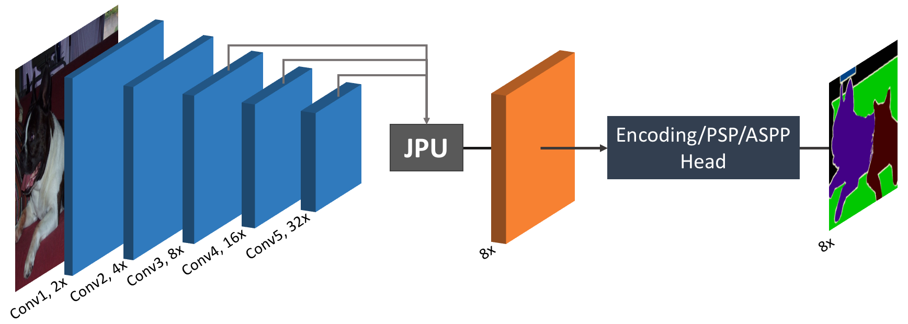
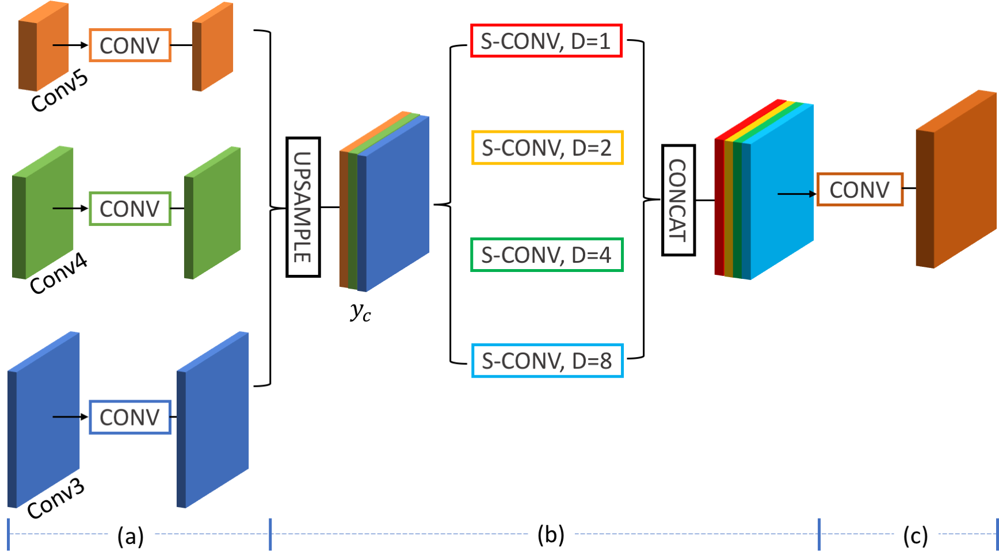
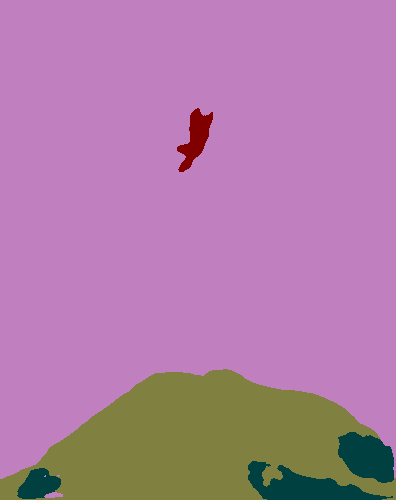
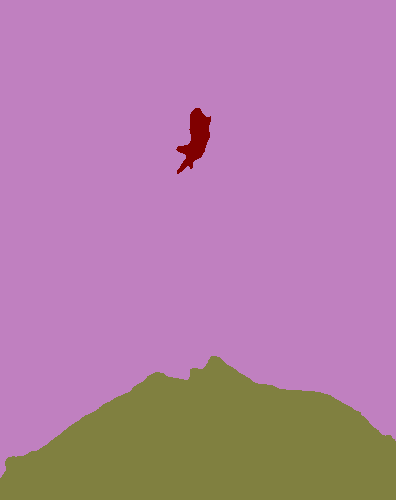
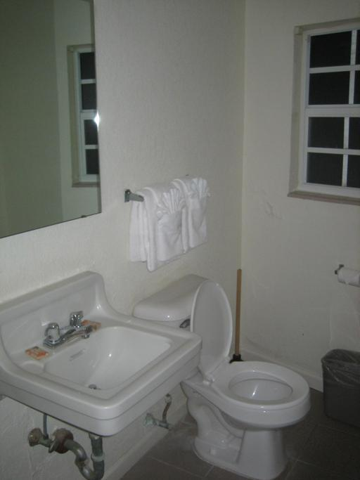
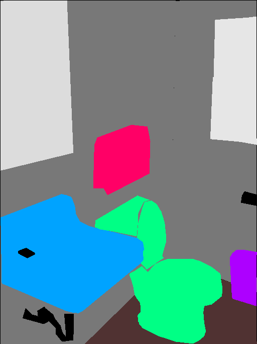
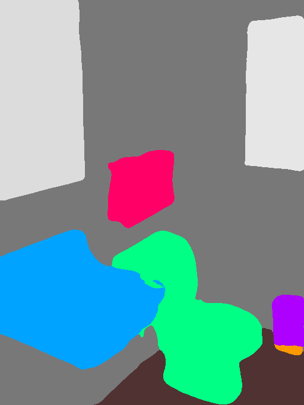
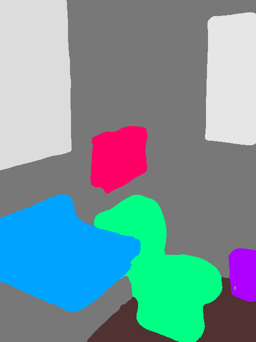

# FastFCN: Rethinking Dilated Convolution in the Backbone for Semantic Segmentation
[[Project]](http://wuhuikai.me/FastFCNProject/)    [[Paper]](http://wuhuikai.me/FastFCNProject/fast_fcn.pdf)    [[arXiv]](https://arxiv.org/abs/1903.11816)    [[Home]](http://wuhuikai.me) 

[](https://paperswithcode.com/sota/semantic-segmentation-pascal-context?p=fastfcn-rethinking-dilated-convolution-in-the)

Official implementation of **FastFCN: Rethinking Dilated Convolution in the Backbone for Semantic Segmentation**.   
A **Faster**, **Stronger** and **Lighter** framework for semantic segmentation, achieving the state-of-the-art performance and more than **3x** acceleration.
```
@inproceedings{wu2019fastfcn,
  title     = {FastFCN: Rethinking Dilated Convolution in the Backbone for Semantic Segmentation},
  author    = {Wu, Huikai and Zhang, Junge and Huang, Kaiqi and Liang, Kongming and Yu Yizhou},
  booktitle = {arXiv preprint arXiv:1903.11816},
  year = {2019}
}
```
Contact: Hui-Kai Wu (huikaiwu@icloud.com)

## Update
**2020-04-15: Now support inference on a single image !!!**
```bash
CUDA_VISIBLE_DEVICES=0,1,2,3 python -m experiments.segmentation.test_single_image --dataset [pcontext|ade20k] \
    --model [encnet|deeplab|psp] --jpu [JPU|JPU_X] \
    --backbone [resnet50|resnet101] [--ms] --resume {MODEL} --input-path {INPUT} --save-path {OUTPUT}
```

**2020-04-15: New joint upsampling module is now available !!!**
- `--jpu [JPU|JPU_X]`: JPU is the original module in the arXiv paper; JPU_X is a pyramid version of JPU.

**2020-02-20: `FastFCN` can now run on every `OS` with `PyTorch>=1.1.0` and `Python==3.*.*`**
- Replace all `C/C++` extensions with `pure python` extensions.

## Version
1. Original code, producing the results reported in the arXiv paper. [[branch:v1.0.0]](https://github.com/wuhuikai/FastFCN/tree/v1.0.0)
2. Pure PyTorch code, with `torch.nn.DistributedDataParallel` and `torch.nn.SyncBatchNorm`. [[branch:latest]](https://github.com/wuhuikai/FastFCN/tree/latest)
3. Pure Python code. [[branch:master]](https://github.com/wuhuikai/FastFCN)

## Overview
### Framework

### Joint Pyramid Upsampling (JPU)


## Install
1. [PyTorch >= 1.1.0](https://pytorch.org/get-started/locally) (Note: The code is test in the environment with `python=3.6, cuda=9.0`)
2. Download **FastFCN**
   ```
   git clone https://github.com/wuhuikai/FastFCN.git
   cd FastFCN
   ```
3. Install Requirements
   ```
   nose
   tqdm
   scipy
   cython
   requests
   ```

## Train and Test
### PContext
```
python -m scripts.prepare_pcontext
```
| Method | Backbone | mIoU | FPS | Model | Scripts |
|:----|:----|:---:|:---:|:---:|:---:|
| EncNet | ResNet-50 | 49.91 | 18.77 |  |  |
| EncNet+JPU (ours) | ResNet-50 | **51.05** | **37.56** | [GoogleDrive](https://drive.google.com/open?id=1Hy_GWVnTyJBNv4Hejwh5LKa8S_ph27y0) | [bash](experiments/segmentation/scripts/encnet_res50_pcontext.sh) |
| PSP | ResNet-50 | 50.58 | 18.08 |  |  |
| PSP+JPU (ours) | ResNet-50 | **50.89** | **28.48** | [GoogleDrive](https://drive.google.com/open?id=1fJItp7B7uz6s69fmquqtm18A72EJE5jm) | [bash](experiments/segmentation/scripts/psp_res50_pcontext.sh) |
| DeepLabV3 | ResNet-50 | 49.19 | 15.99 |  |  |
| DeepLabV3+JPU (ours) | ResNet-50 | **50.07** | **20.67** | [GoogleDrive](https://drive.google.com/open?id=11s20bUkPrZXXmFqYpwC_h1G57CB8g2u9) | [bash](experiments/segmentation/scripts/deeplab_res50_pcontext.sh) |
| EncNet | ResNet-101 | 52.60 (MS) | 10.51 |  |  |
| EncNet+JPU (ours) | ResNet-101 | **54.03 (MS)** | **32.02** | [GoogleDrive](https://drive.google.com/open?id=1GOIma8cXTKfTa2qSIcDO8EmctyoDzHuV) | [bash](experiments/segmentation/scripts/encnet_res101_pcontext.sh) |

### ADE20K
```
python -m scripts.prepare_ade20k
```
#### Training Set
| Method | Backbone | mIoU (MS) | Model | Scripts |
|:----|:----|:---:|:---:|:---:|
| EncNet | ResNet-50 | 41.11 | | |
| EncNet+JPU (ours) | ResNet-50 | **42.75** | [GoogleDrive](https://drive.google.com/open?id=1EdHDjNDtPmVgSD7RYjeyXy7SSYpTzYyN) | [bash](experiments/segmentation/scripts/encnet_res50_ade20k_train.sh) |
| EncNet | ResNet-101 | 44.65 | | |
| EncNet+JPU (ours) | ResNet-101 | 44.34 | [GoogleDrive](https://drive.google.com/open?id=1WFkbf8OWJmLGnOz5M_IxIZtiHKn2_bEp) | [bash](experiments/segmentation/scripts/encnet_res101_ade20k_train.sh) |
#### Training Set + Val Set
| Method | Backbone | FinalScore (MS) | Model | Scripts |
|:----|:----|:---:|:---:|:---:|
| EncNet+JPU (ours) | ResNet-50 |  | [GoogleDrive](https://drive.google.com/open?id=10u8ISncp0NukwQb0K94GsH_AHgT6hgxc) | [bash](experiments/segmentation/scripts/encnet_res50_ade20k_trainval.sh) |
| EncNet | ResNet-101 | 55.67 | | |
| EncNet+JPU (ours) | ResNet-101 | **55.84** | [GoogleDrive](https://drive.google.com/open?id=15gdJeKFy7OXhAr6mQNYvu25LiPwFfQ-Z) | [bash](experiments/segmentation/scripts/encnet_res101_ade20k_trainval.sh) |

**Note:** EncNet (ResNet-101) is trained with `crop_size=576`, while EncNet+JPU (ResNet-101) is trained with `crop_size=480` for fitting 4 images into a 12G GPU.

## Visual Results
|Dataset|Input|GT|EncNet|Ours|
|:----|:---:|:---:|:---:|:---:|
|PContext|||||
|ADE20K|||||

### [More Visual Results](http://wuhuikai.me/FastFCNProject/#visual)

## Acknowledgement
Code borrows heavily from [PyTorch-Encoding](https://github.com/zhanghang1989/PyTorch-Encoding).
